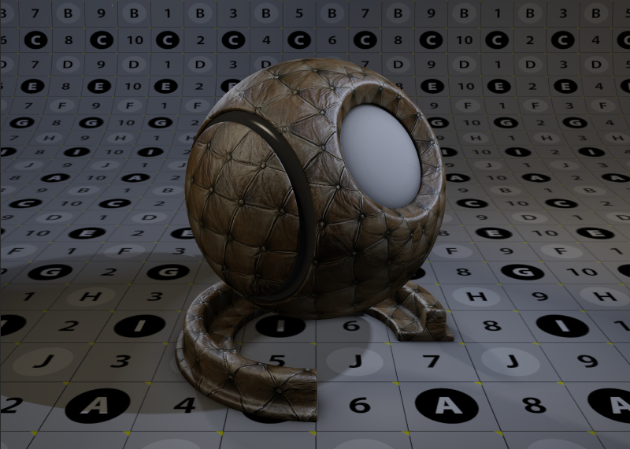
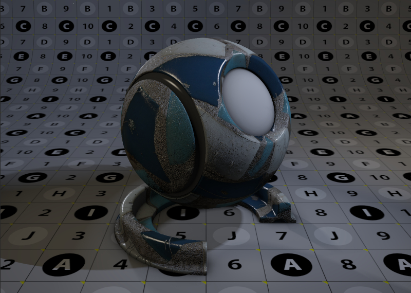
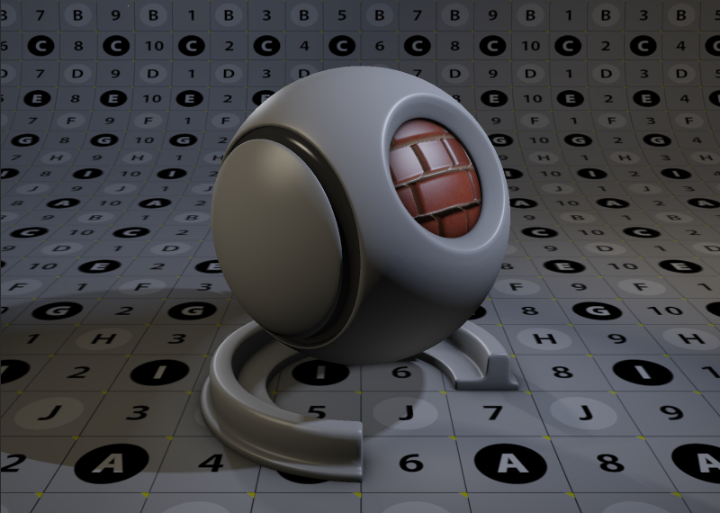
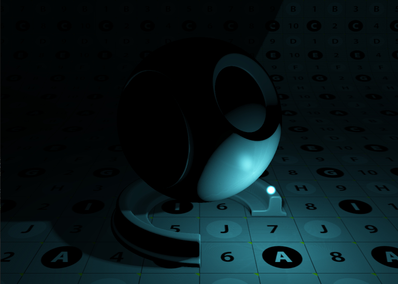

# GL Engine

[](https://opensource.org/licenses/MIT)

GL Engine is simple real time rendering engine built with C++ and OpenGL. The 
aim of the project is to get acquainted with OpenGL and use it to implement some
advanced real time lighting features.



# Features
 - Cameras
    - Target camera for orbiting
    - Free camera
    - Orthogonal camera
 - Lights
    - Directional
    - Point
    - Spot
 - Meshes
    - Various primitive shapes
    - Custom OBJ loader
 - Shading
    - Blinn master shader with texture maps for diffuse, specularity, roughness, etc.
    - Normal mapping
    - Parallax mapping
    - Self illuminated shader
    - Shadow mapping for all light types
    - Handles multiple lights and shadows
    - Image loading for textures
    - 2D Text overlay
    - Cubemap environments
 - Post effects
    - HDR Tone mapping
    - Deferred rendering
    - Screen space ambient occlusion
    - Glow effect


# Usage Instructions

## Requirements
  - Windows
  - Visual Studio 2019
  - Graphics card that supports at least OpenGL 4.4

## Recommended Components
  - [NVidia NSight Visual Studio Edition](https://developer.nvidia.com/nsight-visual-studio-edition) and [Nvidia NSight Graphics](https://developer.nvidia.com/nsight-graphics)
    - Great for debugging everything that gets sent to the graphics card. If you don't have a Nvidia graphics card, you can also use [RenderDoc](https://renderdoc.org/)
  - [GLSL language integration](https://marketplace.visualstudio.com/items?itemName=DanielScherzer.GLSL)
    - Makes GLSL shader writing a whole lot easier

## Getting Started
To get going, simply clone the repository and open `src/gl_engine.sln`.

Ensure that the `gl_demo` is the startup project (it should be **bold** in the `Solution Explorer`).
If not, right click on it inside the `Solution Explorer` and click `Set as Startup Project`.

If you have Visual Studio set up to automatically download NuGet packages, press `F5`
to build and run the solution. The required packages should automatically download. 

If they don't, click `Tools` -> `NuGet Package Manager` -> `Manage NuGet Packages for Solution...` 
You should get a warning saying that some packages are missing. Click `Restore`.

## Making your first 3D scene

First import the engine with 
```C++
#include "gl_engine.h"
``` 
Then you'll need to make a window to display the 3D scene in. `glen` is the namespace for the gl_engine.
```C++
glen::Window window{ "Window name", width, height };
```
Then you'll need a camera to look through. You have the option of two perspective cameras (each with different movement controls): `FreeCamera` and `TargetCamera`. You can also choose `OrthoCamera` for an orthographic view.
```C++
glen::TargetCamera targetCam{};
```
Any item that sits in the 3D scene needs to attached to a `Node` in order to move around. Each node can have an arbitrary number of child nodes. A child node will transform with its parent node.

There are three types of node: `CameraNode`, `LightNode` and `MeshNode`. All lights, cameras and meshes must be attached to their specific node type.

Make a camera node for the camera you just created.
```C++
glen::CameraNode targetCam_node{ "Target Camera", &targetCam };
```

`targetCam` has various methods like `set_clip_far` and `set_focus_target` to help you set up the camera. You can reposition it relative to its focus target with `set_position`.

To move the camera and the focus target together, you'll need to use `set_position` in the `targetCam_node`.

Now we'll need some geometry in the scene so that we've got something to look at. You can either make one of the preset meshes or import an obj with with `glen::OBJ_Loader`. For the moment we'll make a sphere of radius 1.

```C++
glen::Mesh sphere_mesh{ glen::Sphere::createSphere(1.0f) };
```

Before we can attach it to a `MeshNode`, we'll need to give it a material. We'll make a gray blinn material. Attributes prefixed with a 'k' correspond to the names of the corresponding shader properties. A single value for diffuse will set red green and blue to that value (on a 0 to 1 scale)

```C++
glen::BlinnMaterial blinn_white{ "White Blinn" };
blinn_white.set_sampler_value(blinn_white.k_material_diffuse, 0.5f);
```

Now we are ready to combine the material and mesh together into a `MeshNode`.

```C++
glen::MeshNode sphere_mesh_node{ "Sphere Node", &sphere_mesh, &blinn_white };
```

We'll need a light so that the sphere looks a bit more interesting than a black blob. Same deal as before, make the light, attach it to a `LightNode` and reposition as necessary.

```C++
glen::PointLight light;
glen::LightNode light_node{ "Main Light Node", &light };
light_node.set_position( { 0.0f, 10.0f, 5.0f } );
light.set_brightness( 5.0f );
```

To make the light cast shadows, we actually need to make a separate shadow object with a specific shadow map resolution and attach it to the light.

```C++
glen::ShadowMap shadow{ &light_node, 2048 };
```

Finally we'll need to set up the renderer itself and start it running. First make a new `Render` object and give it the same dimensions as the `Window` created earlier. All renderers need a single camera specified in the constructor.

```C++
glen::Renderer renderer{ &targetCam_node, glm::uvec2{ width, height } };
```

Add all the other nodes you've just created.

```C++
renderer.add_node( &sphere_mesh_node );
renderer.add_node( &light_node );
```

Turn on various render settings if desired.

```C++
render.enable_ao(); //Turn on ambient occlusion
```

Make a timer

```C++
glen::Timer timer
```

And set the main render loop going. Use the `update` method of the renderer to advance to the next frame.

```C++
while ( render.poll_events())
{
   render.update( &window, &timer );
}
```

And that's all there is to it. If you build and run the project you should get a basic 3D scene that you can move around in.

`src/gl_demo` contains a demo project for using various parts of `gl_engine`. Feel free to look through there to gain more of an understanding of how the engine works.

# Screenshots






# Acknowledgements
  - [Aleksandras Ševčenko](https://github.com/Coldberg) has been an excellent guide while I've been fumbling around.

# References
  - [Joey Devries](https://joeydevries.com/#home) has some excellent tutorials and an example game engine here on github.
  - [OpenGL Tutorial](http://www.opengl-tutorial.org/). Another excellent resource.
