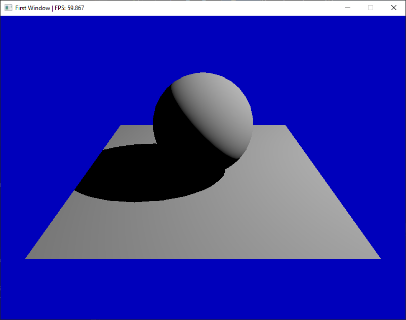

# Making your first 3D scene

First import the engine with 
```C++
#include "gl_engine.h"
``` 

Before anything else, you'll need to create a window, The window initializes a context that's required for the rest of the components.

```C++
GLuint width = 800u;
GLuint height = 600u;
glen::Window window{ "First Window", width, height };
```

Then you'll need a camera to look through. You have the option of two perspective cameras (each with different movement controls): `FreeCamera` and `TargetCamera`. You can also choose `OrthoCamera` for an orthographic view.

`glen` is the namespace for the gl_engine.
```C++
glen::TargetCamera targetCam{};
```
Any item that sits in the 3D scene needs to be attached to a `Node` in order to move around. Each node can have an arbitrary number of child nodes. A child node will transform with its parent node.

There are three types of node: `CameraNode`, `LightNode` and `MeshNode`. All lights, cameras and meshes must be attached to their specific node type.

Make a camera node for the camera you just created.
```C++
glen::CameraNode targetCam_node{ "Target Camera", &targetCam };
```

`targetCam` has various methods like `set_clip_far` and `set_focus_target` to help you set up the camera. You can reposition it relative to its focus target with `set_position`.

In this engine, y is up.

```C++
targetCam.set_position({ 0.0f, 3.0f, 5.0f });
targetCam.set_focus_target({ 0.0f, 0.0f, 0.0f });
```

To move the camera and the focus target together, you'll need to use `set_position` in the `targetCam_node`.

Now we'll need some geometry in the scene so that we've got something to look at. You can either make one of the preset meshes or import an obj with with `glen::OBJ_Loader`. For the moment we'll make a sphere of radius 1.

```C++
glen::Mesh sphere_mesh{ glen::Sphere::create_sphere(1.0f) };
```

Before we can attach it to a `MeshNode`, we'll need to give it a material. We'll make a gray blinn material. Attributes prefixed with a 'k' correspond to the names of the corresponding shader properties. A single value for diffuse will set red green and blue to that value (on a 0 to 1 scale)

```C++
glen::BlinnMaterial blinn_white{ "White Blinn" };
blinn_white.set_sampler_value(blinn_white.k_material_diffuse, 0.5f);
```

Now we are ready to combine the material and mesh together into a `MeshNode`.

```C++
glen::MeshNode sphere_mesh_node{ "Sphere Node", &sphere_mesh, &blinn_white };
```

Move it up so it will appear to sit on top of the plane which we will make in the next step.
```C++
sphere_mesh_node.set_position({ 0.0f, 1.0f, 0.0f });
```


Set up a ground plane. We can use the same material we made for the sphere.

```C++
glen::Mesh ground{ glen::Plane::create_plane(5.0f, 5.0f) };
glen::MeshNode ground_node{ "Ground Plane Node", &ground, &blinn_white };
```

We'll need a light so that the sphere looks a bit more interesting than a black blob. Same deal as before, make the light, attach it to a `LightNode` and reposition as necessary.

```C++
glen::PointLight light;
glen::LightNode light_node{ "Main Light Node", &light };
light_node.set_position( { 5.0f, 6.0f, 0.0f } );
light.set_brightness( 5.0f );
```

To make the light cast shadows, we actually need to make a separate shadow object with a specific shadow map resolution and attach it to the light.

```C++
glen::ShadowMap shadow{ &light_node, 2048 };
```

Shadow maps usually require a bit of tweaking to get right. The minimum and maximum distances are controlled by the near and far clipping planes respectively.

Bias sets an offset for the shadow. Too little bias and you'll get [shadow acne](https://digitalrune.github.io/DigitalRune-Documentation/html/3f4d959e-9c98-4a97-8d85-7a73c26145d7.htm). Too much and the shadow will appear detached from the object.

In general, the larger the difference between the near and the far clipping plane, the smaller the bias needs to be.

Our light is not far from the meshes, so we can use a small value for the far clipping plane and a relatively large bias.
```C++
shadow.set_bias(0.2f);
shadow.set_clip_far(40);
```

Now we'll need to set up the renderer itself and start it running. First make a new `Render` object and give it the dimensions of the window we want to create. All renderers need a single camera specified in the constructor.

```C++
glen::Renderer renderer{ &targetCam_node, glm::uvec2{ width, height } };
```

Add all the other nodes you've just created.

```C++
renderer.add_node( &sphere_mesh_node );
renderer.add_node( &ground_node );
renderer.add_node( &light_node );
```

Turn on various render settings if desired.

```C++
renderer.enable_ao(); //Turn on ambient occlusion
```

Make a timer for keeping track of frames.

```C++
glen::Timer timer;
```
Finally set the main render loop going. Use the `update` method of the renderer to advance to the next frame.

```C++
while ( renderer.poll_events())
{
   renderer.update( &window, &timer );
}
```

And that's all there is to it. If you build and run the project you should get a basic 3D scene that you can move around in. Click and drag to look around.

`src/gl_demo` contains a demo project with various scenes that show of different aspects of `gl_engine`. Feel free to look through there to gain more of an understanding of how the engine works. `FirstScene.h` is the scene from this tutorial. 

